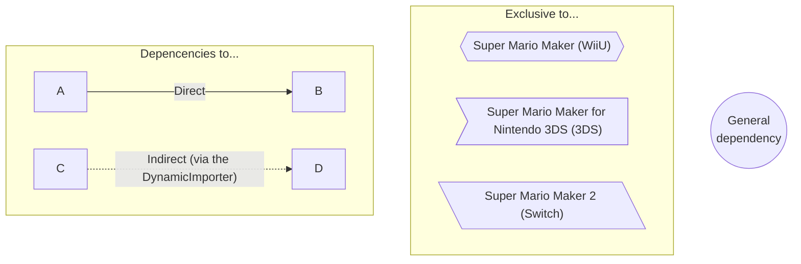
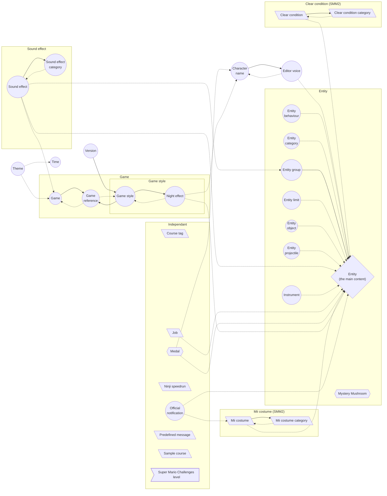

# Super Mario Maker Encyclopedia

https://joookiwi.github.io/smm-encyclopedia

A simple project made to retrieve most (if not every)
information in all 3 Super Mario Maker games. It contains:
 - Super Mario Maker (WiiU) 
 - Super Mario Maker for Nintendo 3DS (3DS) 
 - Super Mario Maker 2 (Switch) 

The information is mostly based on the SMM2 game.

This project is intended to be a simple project to help on research. 
It is also there give the details as simple as they can get. 
More is to add once this huge project is finished.

The languages supported by the project are the ones available in the games:
 -  English ([american](https://joookiwi.github.io/smm-encyclopedia/en_AM)
& [european](https://joookiwi.github.io/smm-encyclopedia/en-EU))
 -  French ([canadian](https://joookiwi.github.io/smm-encyclopedia/fr-CA)
& [european](https://joookiwi.github.io/smm-encyclopedia/fr-EU))
 -   [German](https://joookiwi.github.io/smm-encyclopedia/de)
 -   Spanish ([american](https://joookiwi.github.io/smm-encyclopedia/es-AM)
& [european](https://joookiwi.github.io/smm-encyclopedia/es-EU))
 -   [Italian](https://joookiwi.github.io/smm-encyclopedia/it)
 -   [Dutch](https://joookiwi.github.io/smm-encyclopedia/nl)
 -   Portuguese ([american](https://joookiwi.github.io/smm-encyclopedia/pt-AM)
& [european](https://joookiwi.github.io/smm-encyclopedia/pt-EU))
 -   [Russian](https://joookiwi.github.io/smm-encyclopedia/ru)
 -   [Japanese](https://joookiwi.github.io/smm-encyclopedia/jp)
 -   Chinese ([traditional](https://joookiwi.github.io/smm-encyclopedia/zh-T)
& [simplified](https://joookiwi.github.io/smm-encyclopedia/zh-S))
 -   [Korean](https://joookiwi.github.io/smm-encyclopedia/ko)

The other languages seen in the project can include Hebrew, Polish, Ukrainian & Greek.
Although, they are only there for some names.

List of elements to to

## List of elements to do

- [ ] When giving an url <u>example.com/path</u>, it would be based on the browser language. 
  And for <u>example.com/en-US/path</u>, then the language would be set to American English.
- [ ] Font family
  - [ ] from the Super Mario Maker games
  - [ ] from SMB, SMB3, SMW, NSMBU & SM3DW specifically
- [ ] Color mode implementation (independent of each and another)
  - [ ] Dark mode
  - [ ] Colour-blind mode
- [ ] Search engine.
- [ ] Options that would change the URL based on the application loaded.
- [ ] Sub-pages with reactive URL.

### Sub-page applications
- [ ]          Entity
- [ ]      Character name
- [ ]      Clear condition 
    - [ ]  Clear condition category 
- [x]              Entity limit
- [ ]      Entity projectile
- [ ]      Entity object
- [x]              Entity category
- [ ]      Entity group
- [ ]    Theme
- [ ]      Time
- [x]              Game reference
- [ ]      Game
- [ ]    Game style
- [ ]      Entity behaviour
- [ ]    Sound effect
    - [ ]  Sound effect category
- [x]              Course tag 
- [ ]      Predefined message 
- [ ]      Sample courses 
- [ ]      Medals 
- [ ]      Super Mario Challenges levels 
- [ ]      Job 
- [ ]      Official notification 
- [ ]      Ninji speedrun 
- [ ]          Mystery Mushroom 
- [x]              Mii costume 
    - [x]          Mii costume category 
- [ ]      Editor voice
- [ ]      Instrument
- [ ]      Version

#### Other sub-pages (not directly related to the project)
- [ ]          Power-up priority
- [ ]      Secret pages (by URL, by key combination & maybe other ones)

Development for the web application

## Development for the web application

Files & folders

### Standard used in the project

In order to have a clean way to navigate on the project, multiple standard have been made.

#### Imports

They are separated in different sections 
 - Import ordering
   1. SCSS files _(for React components)_
   2. Dependencies import
   3. Type import (not useful to debug)
   4. Real import (if used at compile time → `import type`)
 - Spacing for the import is aligned for better readability
 - Ordered alphabetically by group

#### Visibility

Since some visibilities are present in other languages (like Kotlin, Java, PHP or C#),
the project utilise some standard on the visibilities.

It utilises the Typescript system for the pre-established visibilities.
Then, for those that are not in the system, it uses somme pattern for it.

| Syntax               | in project |  in Typescript  |         in Javascript         |                                                                            Example |
|----------------------|:----------:|:---------------:|:-----------------------------:|-----------------------------------------------------------------------------------:|
| public [name]        |   public   |     public      |            public             |                                      <pre> public anExample public anExample() |
| [name]               |  package   |     public      |            public             |                                                     <pre>anExample anExample() |
| _[name]              | protected  |    protected    |            public             |                               <pre>protected _anExample protected _anExample() |
| __[name] #[name] |  private   |     private     | __ -> public # -> private | <pre>#anExample #anExample() private __anExample private __anExample() |

#### Folder structure

The files are structured by folder.
Most of them are self-explanatory.

| Path                   | Meaning                                                                  |                                    Things to do | 
|:-----------------------|:-------------------------------------------------------------------------|------------------------------------------------:|
| src/app                | Application                                                              |                                                 |
| src/core               | The core elements of the project                                         |                                                 |
| src/lang               | The languages                                                            |                                                 |
| src/routes             | The routes of the project                                                |                                                 |
| src/util               | The utilities                                                            |     They should me moved into separate projects |
| src/bootstrap          | External dependencies to [Bootstrap](https://getbootstrap.com/)          |                                                 |
| src/navigation         | The application navigation (& footer)                                    |                                                 |
| src/resources          | The application resources (mostly CSV files)                             | Move this directory outside of the `src` folder |
| src/resources/compiled | The compiled (json files) from the CSV **(this should always be empty)** |                                                 |
| public/[any-folder]    | The images (& sounds) of the project                                     |                                                 |

#### File naming

The names of the files are important since some of them are for Typescript
and others gives meaning to them.

| Syntax                                                                                                              | Type of file                                                                        |         Javascript         |         Typescript          |
|:--------------------------------------------------------------------------------------------------------------------|:------------------------------------------------------------------------------------|:--------------------------:|:---------------------------:|
| [singular-name].ts [singular-name].container.ts [singular-name].builder.ts [singular-name].component.ts | A file declaration A file description A Builder class A React component | No Yes Yes Yes | Yes Yes Yes Yes |
| [plural-name].types.ts [plural-name].ts                                                                         | An enumeration declaration file An enumeration file                             |         No Yes         |         Yes Yes         |
| [lower-case-name].ts                                                                                                | Not a class, but some files or functions                                            | Yes or No _(not both)_ |             Yes             |

#### Variable / methods / class naming

The variables, methods & classes use a different format, but they all share at some point the standard. 
They don't follow directly the standard, but have a general format followed.

| Syntax                    |                                                        Description                                                        |                                Applicable for                                | Example                                                                                                                                                                                                                     |
|:--------------------------|:-------------------------------------------------------------------------------------------------------------------------:|:----------------------------------------------------------------------------:|:----------------------------------------------------------------------------------------------------------------------------------------------------------------------------------------------------------------------------|
| [upper-case-name]         |                                    An upper case name (using `_` as a word separator)                                     |                         Constant, Enum instance                          | <pre>AN_EXAMPLE                                                                                                                                                                                                             |
| [lower-case-name]         |                                           A lower case name (using camel case)                                            |                                   Variable                                   | <pre>anExample                                                                                                                                                                                                              |
| [capital-case]            |                                                   A capital case name (                                                   |     Class, Interface, Type, Dynamic import method for class      | <pre>AnExample                                                                                                                                                                                                              |
| [name][_[nameX]*]         |                                      Multiple different names following each others                                       |                             Variable, Method                             | <pre>anExample_withSomething_secret                                                                                                                                                                                         |
| #[name]                   |                                                  **(always)** `private`                                                   |                             Variable, Method                             | <pre>#anExample #anExample()                                                                                                                                                                                            |
| $[name]                   |                              something that starts with a number *(Not a PHP variable)*                               |                             Variable, Method                             | <pre>$1Example $1Example()                                                                                                                                                                                              |
| _[name]                   |                                                 **(always)** `protected`                                                  |                                    Method                                    | <pre>_anExample()                                                                                                                                                                                                           |
| __[name]                  |                                              `private` (with private field)                                               |                           Getter & setter methods                            | <pre>get __anExample() {   this.#anExample } set __anExample(value) {   this.#anExample = value }                                                                                                       |
| _[name]\(…)               |                       `protected` with possibility of arguments _(only called once by getter)_                        |                                Create methods                                | <pre>protected _anExample() {     return somethingToBeCalledOnce } protected _anotherExample(a, b, …,) {     return somethingToBeCalledOnceWith(a, b, …,) }                                             |
| `,`                       |                                                 Ending with a leading `,`                                                 | Creation (Array / Object), Call (method / constructor), Generic type | <pre>[a, b, c,] {a: 1, b: 2, c: 3,} anExample(a, b, c,) new AnExample(a, b, c,)  class AnExample<T,>{ ... } anExample<T,>(t: T,)                                                                    |
| <code>&#124;              |                                                **(always)** Before a join                                                 |                                     Type                                     | <pre>type AnExample = &#124; TypeA &#124; TypeB                                                                                                                                                                             |                                                                            |
| `'` not `"`           | For a string variable, `'` is used instead of `"`  _(This will be changed to be recognizable by other languages)_ |                      String → `"`, Character → `'`                       | <pre>type AnExampleString = 'something' type AnExampleCharacter = 'A'                                                                                                                                                   |
| no `;`                    |                                               **(never)** Ending with a `;`                                               |                Variable, Class, , Interface Type                 | <pre>const anExample = 420 / 69  class AnExample {   fieldA   fieldB }  interface AnExample {   fieldA   fieldB }  type AnExample = \`Jank ${&#124; 'city' &#124; 'game'}\` |
| `000_000` no `000000`     |                                To be less ambiguous in the reading of really long numbers                                 |                                    Number                                    | <pre>const anExampleNumber = 123_456 const anotherExampleNumber = 1_042_069                                                                                                                                             |
| `null` no `undefined` |          To be like Kotlin, Java, C#, PHP & others, the use of `null` is the only one for the nullable variables          |                                     Type                                     | <pre>type AnExample = &#124; AType &#124; null                                                                                                                                                                              |

#### Files using a CSV source

In the core (`src/core/...`), the files have some formatting that each have their responsibility.
The only ones that are used outside are:
 - Interface
 - Enum (sometimes even in the `src/util/DynamicImporter.ts`)
 - The loader types (`Loader.types`)

The rest should not be used outside the same package (folder).

| Format              | Type      |                                                 Description                                                 |                                Dependencies |
|:--------------------|:----------|:-----------------------------------------------------------------------------------------------------------:|--------------------------------------------:|
| [name].template.ts  | Template  |                                   The template associated to the CSV file                                   |                                        Type |
| [name].loader.ts    | Loader    |                                         The file loader (main core)                                         |               Builder Template Type |
| loader.types.ts     | Type      |                                  Types only applicable to the file loaders                                  |                                             |
| [name].builder.ts   | Builder   |                                   The builder class that create the class                                   | Template  Class Enum _(some times)_ |
| [name].provider.ts  | Provider  | The provider class that will get or create the specific instance (will never create duplicate instance) |                        Interface  Class |
| [name].ts           | Interface |                                The class description that is used elsewhere                                 |                                        Type |
| Empty[name].ts      | Singleton |                                          The empty class instance                                           |                                   Interface |
| [name].container.ts | Class     |                                             The class instance                                              |                                   Interface |
| [plural-name].ts    | Enum      |                                     Every elements as an enum instance                                      |                          Loader _(dynamic)_ |

 
The types used in the interface:

| Type        |                                                Use case |
|:------------|--------------------------------------------------------:|
| boolean     |                                        Most of the time |
| number      |                                        Most of the time |
| string      | translation key acronym name fields comment |
| object      |                                              Properties |
| enumeration |                Properties use other `scr/core` elements |

#### Dependencies

Grid

##### Grid dependencies

| Name                                        |                                                                                   Direct dependency                                                                                   |       Indirect dependency        |
|:--------------------------------------------|:-------------------------------------------------------------------------------------------------------------------------------------------------------------------------------------:|:--------------------------------:|
| Entity                                      | Clear condition Entity limit Entity category Theme Time Game Game style Mystery Mushroom Entity behaviour Editor voice Instrument Version |  Entity group Night effect   |
| Character name                              |                                                                                     Editor voice                                                                                      |                                  |
| Clear condition (SMM2)                 |                                                                               Clear condition category                                                                                |              Entity              |
| Clear condition category (SMM2)        |                                                                                                                                                                                       |         Clear condition          |
| Entity limit                                |                                                                                                                                                                                       |              Entity              |
| Entity projectile                           |                                                                                                                                                                                       |              Entity              |
| Entity object                               |                                                                                                                                                                                       |              Entity              |
| Entity category                             |                                                                                                                                                                                       |              Entity              |
| Entity group                                |                                                                                        Entity                                                                                         |                                  |
| Theme                                       |                                                                                                                                                                                       |          Time Game           |
| Time                                        |                                                                                                                                                                                       |                                  |
| Game reference                              |                                                                                                                                                                                       |       Game Game style        |
| Game                                        |                                                                                    Game reference                                                                                     |                                  |
| Game style                                  |                                                                            Game reference Night effect                                                                            |                                  |
| Entity behaviour                            |                                                                                                                                                                                       |              Entity              |
| Sound effect                                |                                                                                 Sound effect category                                                                                 | Entity Entity group Game |
| Sound effect category                       |                                                                                                                                                                                       |           Sound effect           |
| Course tag (SMM2)                      |                                                                                                                                                                                       |                                  |
| Predefined message (SMM2)              |                                                                                                                                                                                       |                                  |
| Sample courses (SMM2)                  |                                                                                                                                                                                       |                                  |
| Medals (SMM1)                          |                                                                                                                                                                                       |    Entity Character name     |
| Super Mario Challenges levels (SMM3DW) |                                                                                                                                                                                       |                                  |
| Job (SMM2)                             |                                                                                                                                                                                       |              Entity              |
| Official notification (SMM2)           |                                                                                                                                                                                       |      Entity Mii costume      |
| Ninji speedrun (SMM2)                  |                                                                                                                                                                                       |                                  |
| Mystery Mushroom (SMM1)                |                                                                                                                                                                                       |                                  |
| Mii costume (SMM2)                     |                                                                                 Mii costume category                                                                                  |              Entity              |
| Mii costume category (SMM2)            |                                                                                                                                                                                       |           Mii costume            |
| Editor voice                                |                                                                                                                                                                                       |    Entity Character name     |
| Instrument                                  |                                                                                                                                                                                       |              Entity              |
| Version                                     |                                                                                      Game style                                                                                       |                                  |

Flowchart (does not work on the mobile app)

Legends

##### Flowchart dependencies

The dependencies imply that the entity uses almost everything in the project. 
So, some recursive dependencies are in place to make the project compile.

To simplify the diagram, the entity dependencies has been removed to help readability. 
And the dependencies used in the Entity are: 
1. Clear condition
2. Editor voice
3. Entity behaviour
4. Entity category
5. Entity group _(by dynamic import)_
6. Entity limit
7. Entity projectile
8. Entity object
9. Game
10. Game style
11. Instrument
12. Mystery Mushroom
13. Night effect _(by dynamic import)_
14. Theme
15. Time
16. Version

NPM commands

### NPM commands

#### Prerequisites

Before running the application, make sure that `npm` is installed.

Then, from there,
 - run `npm install` to install the `node_modules` package

#### Run the project locally (desktop and mobile)

To run the project, the command `npm run start` is the only thing to do.
 - Start the execution of the tools;
 - Start the development mode;
 - Reload on edits (and save);
 - In the console (and command prompt), display any lint errors.

The project could also be run with `npm run fast-start` to omit:
 - CSV → Json (`resources/csv` → `src/resources/compiled`)
 - Copy images for CSS (`public/*` → `src/resources/images`)
 - Copy the locales from `resources/locale` to the `src/lang/locale`
 - (Other things in the future)

By default, it will open it in the default browser automatically.
If it has not worked, then, open [localhost:3000/smm-encyclopedia](http://localhost:3000/smm-encyclopedia) to display the application.

If it needs to be tested on other devices than the local machine, there will be another address.
An example could be [192.168.4.20:3000/smm-encyclopedia](http://192.168.4.20:3000/smm-encyclopedia).

#### Running tests

The command to execute the tests is `npm run test`.

Then, from  that, it will start an interactive watch mode.
For more details, see [how to run the tests](https://facebook.github.io/create-react-app/docs/running-tests).

#### Deploying the changes to the server

Since the project uses the workflow (in [.github/workflows/workflow.yml](https://github.com/joooKiwi/smm-encyclopedia/blob/main/.github/workflows/workflow.yml)),
it will automatically push the changes once there is a commit in the main branch.

It automatically calls the command `npm run deploy` (implicitly calling `npm run predeploy`).

With the deployment, it will automatically call `npm run build` and will:
 - Minify of the files;
 - Contain files formatted in _static/js/\[420.jank69].chunk.js_ and _static/css/\[420.jank69].chunk.css_.

See [the application's deployment](https://facebook.github.io/create-react-app/docs/deployment) to know in details how the **React build** is done.

The code will be pushed in the branch [github-pages branch](https://github.com/joooKiwi/smm-encyclopedia/tree/gh-pages) by the workflow.

